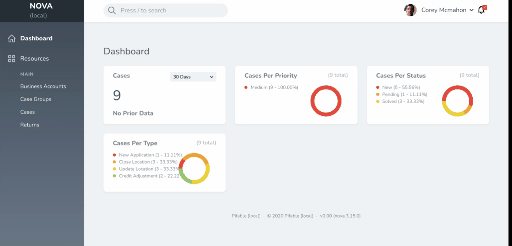

# Mynabird


Laravel/Nova package for Facebook-style alerts.

Currently supports Pusher for real-time notification when a new alert is received (and dynamic update of the unread counter).



## Installation

The package can be installed through Composer.

```bash
composer require montopolis/mynabird
```

Make sure all vendor files are published and migrations run:

```bash
php artisan vendor:publish --provider="Montopolis\Mynabird\MynabirdServiceProvider"
php artisan migrate
```

Assuming you're using Nova, you'll also need to publish Nova's vendor templates (if you haven't already) so you can insert the Mynabird partials: 

```bash
php artisan nova:publish
```

... and then add these two lines to the Nova layout template:

```html
// in file: resources/views/vendor/nova/layout.blade.php

  ...

  <dropdown class="ml-auto h-9 flex items-center dropdown-right">
      @include('nova::partials.user')
  </dropdown>

  @include('mynabird::alert-feed') <!-- AND THIS LINE HERE -->

  ...

    <!-- Build Nova Instance -->
    <script>
        window.Nova = new CreateNova(config)
    </script>

    <!-- Alerts -->
    @include('mynabird::javascript') <!-- INCLUDE THIS LINE HERE -->

   ...
```

If you wish to use real-time notifications, make sure Pusher is configured via `config/broadcasting.php` and/or the .env file; for example:

```bash
# Set the broadcast driver to send events to Pusher:
BROADCAST_DRIVER=pusher

# Add the pusher config, which you can find/configure via the dashboard: https://dashboard.pusher.com
PUSHER_APP_ID=aaabbbcccdddeeefffgg
PUSHER_APP_KEY=hhhiiijjjkkklllmmmnn
PUSHER_APP_SECRET=1000001
PUSHER_APP_CLUSTER=mt1
``` 

Alternatively if you wish to disable real-time notifications you may do so via the Mynabird configuration:

```php
<?php
// in config/mynabird.php
return [
    'should_broadcast' => false,
];
```

If broadcasting is disabled users will need to refresh to see new alerts.

## Usage

You can trigger alerts using the `AlertRepository` which (assuming MynabirdServiceProvider has been loaded) can be resolved through the Laravel IoC container:

```php
<?php

declare(strict_types=1);

namespace App\Console;

use Montopolis\Mynabird\DataObjects\Alert;
use Montopolis\Mynabird\Interfaces\AlertsRepository;

class BroadcastAlert extends Command
{
    protected $signature = 'app:broadcast-alert';
    protected $description = 'Send an alert to all users.';

    protected $alertsRepository;

    public function __construct(AlertsRepository $alertsRepository)
    {
        parent::__construct();
        $this->alertsRepository = $alertsRepository;
    }

    public function handle()
    {
        // Create an alert object: Montopolis\Mynabird\DataObjects\Alert
        $alert = new Alert(
            null,
            $title,
            $body,
            $url,
            $level,
            null, // set to user ID for individual notification
            true // set to `true` for broadcast message
        );

        // Send the alert:
        $this->alertsRepository->store($alert);
    }
}
```

## Credits

* UI and stylesheets adapted from [coreproc/nova-notification-feed](https://github.com/coreproc/nova-notification-feed).

## License

This software uses the MIT License. Please see [License File](LICENSE.md) for more information.


